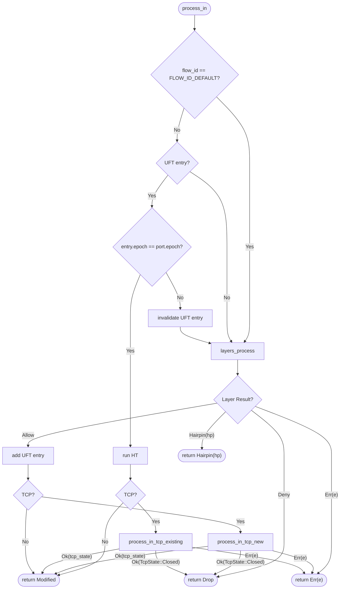

The size of the TCP flow table is currently 8096.

```mermaid
flowchart TD
	process_in([process_in]) --> is_def_id{flow_id == FLOW_ID_DEFAULT?};
	is_def_id -- Yes --> lp[layers_process];
	is_def_id -- No --> check_uft{UFT entry?};
	check_uft -- Yes --> same_epoch{entry.epoch == port.epoch?};
	check_uft -- No --> lp;
	same_epoch -- Yes --> run_ht[run HT];
	same_epoch -- No --> inv[invalidate UFT entry];
	inv --> lp;
	run_ht --> is_tcp_uft{TCP?};
	is_tcp_uft -- Yes --> pite[process_in_tcp_existing];
	is_tcp_uft -- No --> rm([return Modified]);
	lp --> lr{Layer Result?};
	lr -- Allow --> uft_add[add UFT entry];
	lr -- Deny --> rd([return Drop]);
	lr -- "Hairpin(hp)" --> rhp(["return Hairpin(hp)"]);
	lr -- "Err(e)" --> re(["return Err(e)"]);
	pitn -- "Ok(TcpState::Closed)" --> rd;
	pitn -- "Ok(tcp_state)" --> rm;
	pitn -- "Err(e)" --> re;
	pite -- "Ok(TcpState::Closed)" --> rd;
	pite -- "Ok(tcp_state)" --> rm;
	pite -- "Err(e)" --> re;
	uft_add --> is_tcp_no_uft{TCP?};
	is_tcp_no_uft -- Yes --> pitn[process_in_tcp_new];
	is_tcp_no_uft -- No --> rm;
```
